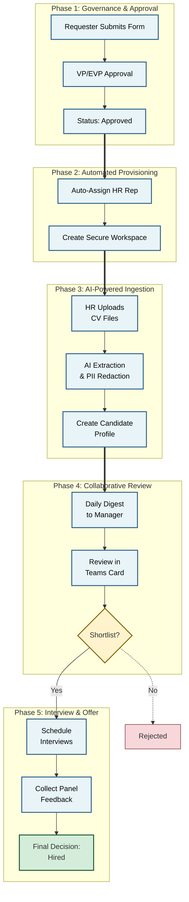

# Enterprise Recruitment Workflow Automation — Privacy-First, Governed Hiring Pipelines

> *Live at a 2,000+ employee organization. 90-day handover with ongoing ops care.*

**The Challenge:**
Like many Operations-Heavy HR departments, the client was drowning in a manually managed spreadsheet process. 

*   **Manual Data Entry:** HR Reps spent hours re-typing data from CVs into trackers.

*   **Email Chaos:** Approvals were buried in email chains, making it impossible to audit "who approved what."

*   **SLA Blindness:** Requisitions would sit "stuck" for weeks with no visibility until a Hiring Manager complained.

*   **Data Silos:** Hiring Managers had zero visibility into their own pipeline without emailing HR.

**Project Status & Scope:**

*   **Live (Phase-1):** AI-assisted CV extraction, SLA monitoring (Warning/Due/Breached), deterministic approval routing and Teams-based human review — all data stored inside the client’s Microsoft 365 tenant (SharePoint & Teams).

*   **Optional (Phase-2):** Immutable audit ledger and blockchain timestamping (available as an upgrade).

**Confidentiality Note:**

*This case study describes an active deployment where I lead process improvement within a 2,000+ org. For confidentiality of the client, any data shown is synthetic or redacted.*

---

## 4 Key Business Outcomes

> **Privacy Policy:** All CVs are forwarded to hiring managers regardless of AI confidence; the AI only assists by extracting structured fields and highlighting ambiguous items for follow-up.

### 1. Fast, Privacy-First AI-Assisted CV Processing
We eliminated the most tedious part of recruitment.

*   **Before:** HR typically spends 5-10 minutes per CV on manual data entry.

*   **After:** **High-Confidence Automated Extraction.** HR drops a CV; a privacy-first AI pipeline redacts PII, extracts 20+ structured fields, and creates a candidate profile. Ambiguous items are flagged and routed to human review.

Note: AI assists with structured extraction only; HR may still follow up with candidates for details not present in CVs.

### 2. Enforced Approval Workflows
We replaced "Email Approvals" with a rigid, auditable workflow.

*   **Mechanism:** The system automatically routes requisitions for VP approval (and auto-triggers EVP approval for Senior Grades).

*   **Result:** **Deterministic Approval Gating.** The system enforces required approval steps (VP/EVP thresholds) at the process level — approvals cannot be bypassed via email.

### 3. Active SLA Monitoring (The "Guardian" System)
The system prevents delays before they happen.

*   **Mechanism:** A "Guardian" process runs daily, checking every single candidate and requisition against their SLA targets.

*   **Result:** **No "Stuck" Items.** The system sends automated *Warnings* when a deadline approaches and *Escalations* to management if a deadline is breached.

### 4. Real-Time Leadership Visibility
We replaced "End-of-Month Reports" with live data.

*   **Result:** A live dashboard updates automatically every time a candidate status changes, giving leadership real-time visibility into `Time-to-Fill`, `Pipeline Health`, and `Active Headcount`.

---

## Why This System Is Trustworthy for Enterprise

**How decisions are made — in plain language:**
AI extracts candidate data and highlights uncertainties. Deterministic rules (code) enforce approvals and routing. When the system can’t be confident, humans intervene — recruiters review and make the final call. This hybrid pattern prevents automation errors and preserves compliance.

**Data & Security:**
No external cloud storage. All docs, logs and process artifacts remain in the client’s Microsoft 365 tenant (SharePoint). Credentials & secrets are kept in tenant Key Vault or equivalent. Full data deletion scripts available on contract completion.

**Onboarding & Change Management:**
We deliver a practical change plan: admin runbooks, configuration-as-code, three 90-minute admin training sessions, and phased rollout guidance. Handover includes a 90-day transitional support window; optional ongoing ops care packages available.

---

## Technical Snapshot

*   **Architecture:** Hybrid Approach.
    *   **Microsoft Power Platform** for process orchestration and user interfaces.
    *   **Azure Functions (Python)** for the secure, high-performance AI engine.
*   **Integration:** Deep integration with **Microsoft Teams** (Interactive Review Cards), **Outlook** (Calendar Automation), and **SharePoint** (Document Management).

---

# Appendix: The Automated Workflow

*The system orchestrates the entire lifecycle across 5 distinct phases.*

## Sample System Log (Privacy-Redacted)

*Real-time processing logs tracking ingestion confidence and PII safety.*

| Log ID | Timestamp | Action | Confidence | PII Redacted | Status | Next Action |
| :--- | :--- | :--- | :--- | :--- | :--- | :--- |
| LOG-4921 | 2024-02-05 09:14:22 | CV Ingestion | 98.5% | YES (8 Entities) | Success | Routing to HM Review |
| LOG-4922 | 2024-02-05 09:15:01 | CV Ingestion | 72.0% | YES (4 Entities) | **Flagged** | **Routed to HR Review (Ambiguous)** |
| LOG-4923 | 2024-02-05 09:16:45 | SLA Monitor | N/A | N/A | Warning | Email Sent to Approver |
