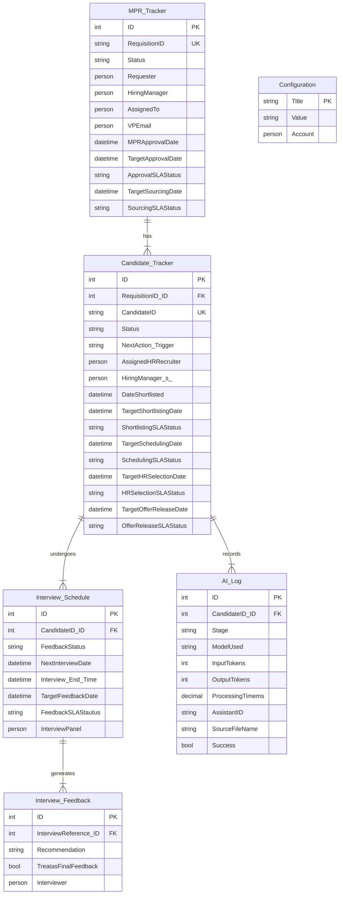
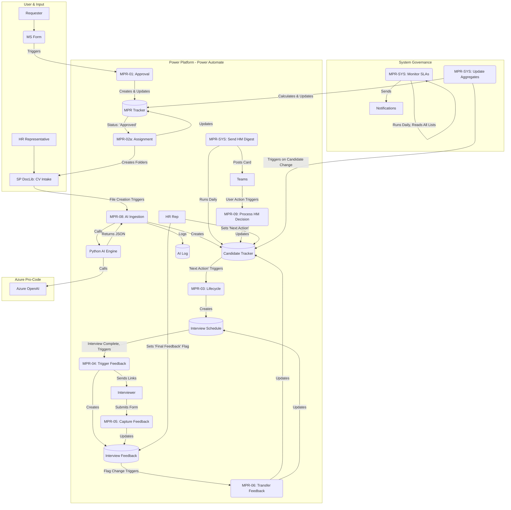

# 02: Solution Architecture

## 1. Introduction

This document provides a detailed architectural overview of the Manpower Requisition (MPR) Automation Suite. It is intended for a technical audience who need to understand *how* the solution is constructed, the relationships between its components, and the design principles that govern its operation.

## 2. Core Architectural Principles

The design of this solution is guided by key principles to ensure it is robust, scalable, and maintainable.

1.  **Hybrid Architecture:** The solution leverages a "best-of-breed" approach, combining the strengths of the **Microsoft Power Platform** for orchestration, user interaction, and state management, with **Azure Functions (Python)** for complex, high-performance data processing and AI integration.
2.  **Decoupled & Modular Flows:** Each Power Automate flow is designed to perform a specific business function (e.g., "HR Assignment," "SLA Monitoring"). This modularity prevents the creation of monolithic flows and simplifies maintenance.
3.  **Event-Driven Logic:** The end-to-end process is orchestrated through status changes and user actions in SharePoint, creating a resilient and logical "state machine."
4.  **Centralized Configuration:** Business rules (SLA days) and key personnel (VPs, HR Manager) are stored in a dedicated SharePoint `Configuration` list, allowing for administrative updates without code changes.
5.  **Secure by Design:** The system enforces a "need-to-know" security model through the automated application of **item-level permissions** on all MPR and Candidate records.

## 3. Technology Stack

| Component | Technology | Purpose |
| :--- | :--- | :--- |
| **Orchestration Engine** | Power Automate | Hosts the core business logic, triggers, and orchestration for the entire process. |
| **Data Backend** | SharePoint Online | Provides the relational data storage through a series of structured lists. |
| **Intelligent Processing** | **Azure Functions (Python)** | **The "Pro-Code" Engine.** Performs heavy-lifting tasks: robust document parsing, AI/LLM API calls, and complex data transformation. |
| **Artificial Intelligence**| **Azure OpenAI Service** | Provides the GPT models for CV data extraction and analysis. |
| **User Interaction** | MS Forms, Teams (Adaptive Cards), Outlook | Offer native, user-friendly interfaces for data entry, approvals, and notifications. |
| **File Management** | SharePoint Document Libraries | Manages the lifecycle of CV documents in a structured folder system. |

## 4. SharePoint Data Model

The foundation of the solution is a set of interconnected SharePoint lists designed to function as a relational database.

### 4.1. Entity Relationship Diagram (ERD)

### 4.2. List Definitions

#### 1. `MPR Tracker`
The master list for all manpower requisitions.

| Column Name | Data Type | Purpose & Notes |
| :--- | :--- | :--- |
| Title, BusinessUnit, Grade, etc. | Various | Core details from the MS Form submission. |
| **RequisitionID** | Single line of text | The unique, system-generated business key (e.g., `MPR-EC-024`). |
| **Status** | Choice | The primary lifecycle state of the requisition (e.g., `MPR Form Submitted`, `MPR Approved`, `CV Sourcing`, `Hiring Complete`). |
| Requester, HiringManager, AssignedTo | Person | Key personnel associated with the requisition. |
| **MPRApprovalDate** | Date/Time | Timestamp for when the final approval was received. |
| **TargetApprovalDate** | Date/Time | The calculated SLA target date for the initial approval. |
| **ApprovalSLAStatus** | Choice | State tracker for the Approval SLA (`On Track`, `Warning Sent`, etc.). |
| **TargetSourcingDate**| Date/Time | The calculated SLA target date for sourcing to begin. |
| **SourcingSLAStatus** | Choice | State tracker for the Sourcing SLA. |
| *PositionsFilled, AvgTimeToFill, etc.*| Number | Aggregated KPI fields updated by the `UpdateMPRAggregates` flow. |

#### 2. `Candidate Tracker`
Contains a record for every candidate being considered for a position.

| Column Name | Data Type | Purpose & Notes |
| :--- | :--- | :--- |
| Title (Candidate Name), Email, Phone, etc. | Various | Core candidate profile details, mostly populated by the AI engine. |
| **RequisitionID** | Lookup | Foreign key linking the candidate to the parent `MPR Tracker` item. |
| **CandidateID** | Single line of text | The unique, system-generated business key (e.g., `MPR-EC-024-C01`). |
| **Status** | Choice | The primary lifecycle state of the candidate (e.g., `Sourced`, `Pending HM Review`, `Shortlisted`, `Interview Process Ongoing`). |
| **NextAction_Trigger** | Choice | **The primary user control field** for the HR Representative (e.g., `Schedule Next Interview`). |
| DateShortlisted, DateofInterviewEvaluationForm, etc. | Date/Time | Key milestone timestamps in the candidate's journey. |
| **TargetShortlistingDate**| Date/Time | Calculated SLA target date for the HM to review the candidate. |
| **ShortlistingSLAStatus**| Choice | State tracker for the Shortlisting SLA. |
| *(...and so on for all other `Target...Date` and `...SLAStatus` columns)* | | |

#### 3. `Interview Schedule`
Logs every scheduled interview event. One row per interview.

| Column Name | Data Type | Purpose & Notes |
| :--- | :--- | :--- |
| **CandidateID** | Lookup | Foreign key linking the interview event to the `Candidate Tracker`. |
| **FeedbackStatus** | Choice | The state of the feedback collection process (`Pending`, `Requests Sent`, `Received`). |
| NextInterviewDate, Interview_End_Time | Date/Time | The start and end time of the scheduled interview. |
| **TargetFeedbackDate**| Date/Time | The calculated SLA target date for feedback collection. |
| **FeedbackSLAStautus**| Choice | State tracker for the Feedback Collection SLA. |
| InterviewPanel | Person (multi-select)| The individuals invited to the interview. |

#### 4. `Interview Feedback`
Captures the detailed feedback from each individual interviewer.

| Column Name | Data Type | Purpose & Notes |
| :--- | :--- | :--- |
| **InterviewReference**| Lookup | Foreign key linking the feedback to the specific `Interview Schedule` event. |
| Interviewer | Person | The individual who submitted this feedback. |
| Recommendation | Choice | The key decision from the interviewer (e.g., `Recommend to Proceed`). |
| **TreatasFinalFeedback**| Yes/No | A checkbox for the HR Rep to designate this as the definitive feedback, triggering the finalization flow. |

#### 5. `AI Log`
Provides a tamper-evident audit trail of every AI interaction during CV ingestion.

| Column Name | Data Type | Purpose & Notes |
| :--- | :--- | :--- |
| **CandidateID** | Lookup | Links the telemetry record back to the originating candidate profile. |
| Stage | Choice/Text | Identifies the logical step within the AI pipeline (e.g., `Extraction`, `Summarisation`). |
| ModelUsed | Single line of text | Records the assistant/model invoked for traceability. |
| InputTokens / OutputTokens | Number | Captures token counts for cost tracking and capacity planning. |
| ProcessingTimems | Number | Millisecond duration for the AI call, useful for performance monitoring. |
| AssistantID | Single line of text | Stores the specific assistant identifier used in Azure OpenAI. |
| Success | Yes/No | Indicates whether the call completed successfully. |
| ErrorMessages | Multiple lines of text | Persisted only when `Success` is false, helping with postmortems. |
| SourceFileName | Single line of text | The CV file name tied to the processing event. |

### 5. Key Management and Relational Integrity

| List Name | Primary Key (PK) | Business Key (Unique ID) | Foreign Key (FK) | Relationship Established |
| :--- | :--- | :--- | :--- | :--- |
| **MPR Tracker** | `ID` (SharePoint Int) | `RequisitionID` | N/A | Master Table |
| **Candidate Tracker** | `ID` (SharePoint Int) | `CandidateID` | `RequisitionID` -> MPR Tracker `ID` | Links a candidate to a single requisition. |
| **Interview Schedule** | `ID` (SharePoint Int) | N/A | `CandidateID` -> Candidate Tracker `ID` | Links an interview event to a single candidate. |
| **Interview Feedback** | `ID` (SharePoint Int) | N/A | `InterviewReference` -> Interview Schedule `ID` | Links a feedback entry to a single interview event. |
| **AI Log** | `ID` (SharePoint Int) | N/A | `CandidateID` -> Candidate Tracker `ID` | Stores per-call AI telemetry tied back to the originating candidate. |

**Crucially, all `GetItem` or `Update item` operations in Power Automate use the SharePoint list's integer `ID` (the Primary Key) to reference items, ensuring unambiguous updates.** The Business Keys (`RequisitionID`, `CandidateID`) are generated and used for display, search, and human-readable tracking only.

## 6. Solution Components and Orchestration

### 6.1. High-Level Architecture Diagram

### 5.2. Orchestration and Control Mechanism

The system uses a sophisticated event-driven model:

1.  **System-Driven Triggers:** Automated handoffs based on a `Status` field changing in SharePoint. This orchestrates the main phases of the process (e.g., `MPR Approved` triggers the assignment flow).

2.  **File-Driven Triggers:** The creation of a CV file in the `CV Intake` library is the event that triggers the entire AI processing pipeline.

3.  **User-Driven Triggers:** The **`Next Action (Trigger)`** column in the `Candidate Tracker` list acts as a "control panel" for the HR Representative, allowing them to command the system to perform specific actions like scheduling interviews.

4.  **Time-Driven Triggers:** Scheduled flows (`Monitor SLAs`, `Send HM Digest`) run on a fixed cadence (daily) to perform proactive monitoring and batch notifications.

5.  **Telemetry & Audit Logging:** As part of every AI-assisted ingestion, the system captures a detailed telemetry record (stage, model, token usage, duration, success flag) in the `AI Log` list. This feeds compliance reporting, cost tracking, and troubleshooting without rerunning the original CV processing.

## 6. Security Architecture: Item-Level Permissions

A critical feature of this architecture is its "Secure by Design" approach. The system does not rely on simple filtered views for security.

-   **Principle:** A true "need-to-know" model is enforced.
-   **Mechanism:** The transactional flows (`MPR-01` and `MPR-03`) contain dedicated steps (`Stop sharing...` and `Grant access...`) that run immediately after an item is created.
-   **Process:**
    1.  The flow first **breaks the permission inheritance** of the new SharePoint item, making it private to only administrators.
    2.  It then **explicitly grants** `View` or `Edit` permissions only to the specific individuals associated with that item (e.g., the Requester, the assigned HR Rep, the Hiring Manager, and the VPs).
-   **Result:** A user navigating directly to the list URL will only ever see the items they have been explicitly granted access to. This provides a robust and auditable security model that prevents any unauthorized data access.

---
_This document describes the architectural foundation. For a detailed, step-by-step breakdown of the logic within each component, please refer to the [03-Technical-Flow-Breakdown.md](./03-Technical-Flow-Breakdown.md) and the README within the `ai-processing-azure-functions` project folder._
