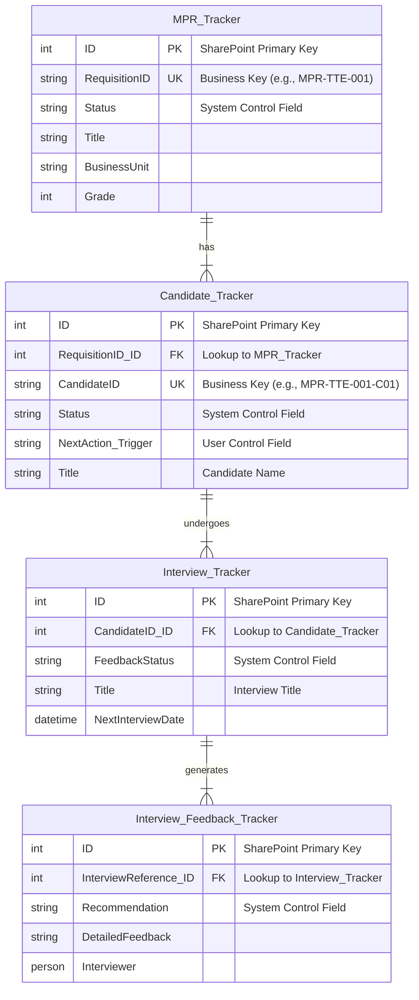
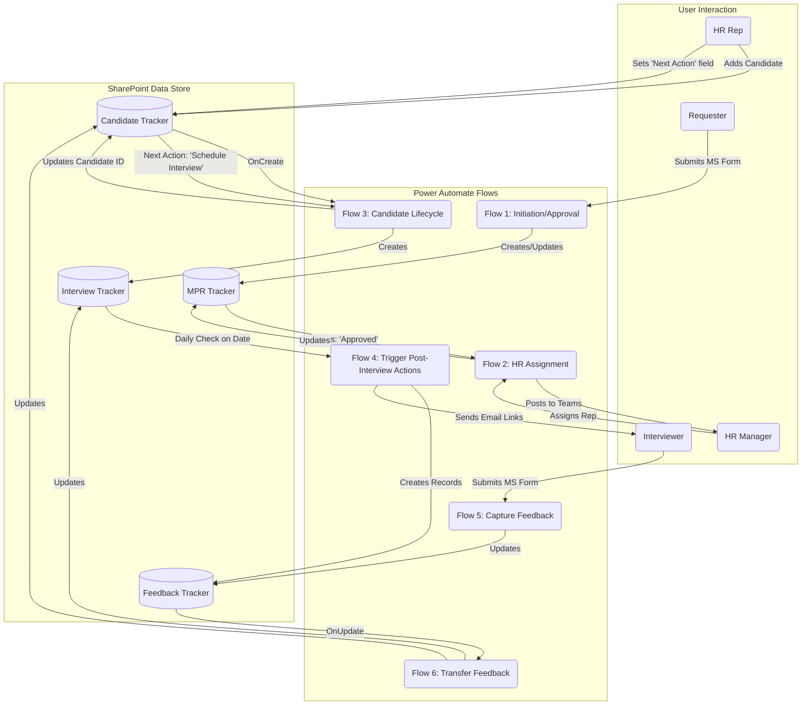

# 02: Solution Architecture

## 1. Introduction

This document provides a detailed architectural overview of the Manpower Requisition (MPR) Automation Suite. It is intended for a technical audience, including architects, developers, and system administrators, who need to understand *how* the solution is constructed, the relationships between its components, and the design principles that govern its operation.

While the [Business Process Overview](./01-Business-Process-Overview.md) explains *what* the system does, this document explains *how* it does it.

## 2. Core Architectural Principles

The design of this solution is guided by four key principles to ensure it is robust, scalable, and maintainable.

1.  **Decoupled & Modular Flows:** Each Power Automate flow is designed to perform a specific, isolated business function (e.g., "Initiation & Approval", "HR Assignment"). This modularity prevents the creation of a single, monolithic flow, making the system easier to debug, test, and enhance.
2.  **Event-Driven Logic:** The entire end-to-end process is orchestrated through events, which are either **system-driven** (a status change in a SharePoint list) or **user-driven** (an HR Rep selecting an option in the `"Next Action (Trigger)"` field).
3.  **Centralized Configuration:** Business rules and key personnel data (e.g., VP/EVP approvers, HR Team members) are not hard-coded within the flows. They are stored in a dedicated SharePoint "Configuration" list, allowing administrators to update critical parameters without modifying and redeploying the automation logic.
4.  **Relational Data Model:** SharePoint lists are used as a relational database. Relationships between entities (Requisitions, Candidates, Interviews) are maintained using lookup columns, and a strict key management strategy ensures data integrity.

## 3. Technology Stack

The solution is built exclusively within the Microsoft Power Platform ecosystem.

| Component                   | Technology            | Purpose                                                                                |
| :-------------------------- | :-------------------- | :------------------------------------------------------------------------------------- |
| **Automation Engine**         | Power Automate        | Hosts the core business logic, integrations, and orchestration for the entire process.   |
| **Data Backend**            | SharePoint Online     | Provides the relational data storage through a series of structured lists.             |
| **User Input & Interaction** | Microsoft Forms, Teams, Outlook | Offer native, user-friendly interfaces for data entry, approvals, and notifications. |
| **File Handling**           | OneDrive for Business | Manages file attachments submitted through Microsoft Forms before they are moved to SharePoint. |

## 4. SharePoint Data Model

The foundation of the solution is a set of four interconnected SharePoint lists designed to function as a relational database.

### 4.1. Entity Relationship Diagram (ERD)

The following diagram illustrates the relationships between the core data tables (SharePoint Lists), now including the critical user control field.

### 4.2. List Definitions

#### 1. MPR Tracker (`d72807b7-95af-4b7b-9987-20647d0037f1`)
The master list for all manpower requisitions. It is the single source of truth for the status and details of any hiring request.
-   **Primary Key:** `ID` (System-generated SharePoint integer).
-   **Business Key:** `RequisitionID` (Calculated, human-readable ID).
-   **Control Field:** `Status` (e.g., "MPR Approved", "CV Sourcing"). This field primarily drives **system-to-system** automation handoffs.

#### 2. Candidate Tracker (`708a7843-8d42-4004-933a-6e235d113e6f`)
This list contains a record for every candidate being considered for a position.
-   **Foreign Key:** `RequisitionID` (Lookup to the `MPR Tracker` list, establishing a one-to-many relationship).
-   **Business Key:** `CandidateID` (Calculated, human-readable ID).
-   **Control Fields:**
    -   `Status`: Reflects the candidate's current state in the pipeline (e.g., "Shortlisted", "Interview Process Ongoing").
    -   `NextAction_Trigger`: **This is the primary user control field.** The HR Representative selects a value here (e.g., "Schedule Next Interview", "Request Offer Approval") to command the system to perform a specific action.

#### 3. Interview Tracker (`5a2899d6-458a-4865-a81b-8657be01c4fa`)
This list logs every scheduled interview event for a candidate.
-   **Primary Key:** `ID` (System-generated SharePoint integer).
-   **Foreign Key:** `CandidateID` (Lookup to the `Candidate Tracker` list).
-   **Control Field:** `FeedbackStatus` (e.g., "Pending", "Requests Sent", "Received").

#### 4. Interview Feedback Tracker (`3cb57c8b-b3f3-4a1f-b1c1-d35e5dec7169`)
This list captures the detailed feedback provided by each interviewer.
-   **Primary Key:** `ID` (System-generated SharePoint integer).
-   **Foreign Key:** `InterviewReference` (Lookup to the `Interview Tracker` list).
-   **Control Field:** `Recommendation` (e.g., "Recommend to Proceed").

## 5. Key Management and Relational Integrity

A precise key management strategy is essential for the system's reliability. The system uses a combination of system-generated primary keys, human-readable business keys, and lookup columns (foreign keys) to maintain relationships.

| List Name                    | Primary Key (PK)      | Business Key (Unique ID) | Foreign Key (FK)                 | Relationship Established                                |
| :--------------------------- | :-------------------- | :----------------------- | :------------------------------- | :------------------------------------------------------ |
| **MPR Tracker**              | `ID` (SharePoint Int) | `RequisitionID`          | N/A                              | Master Table                                            |
| **Candidate Tracker**        | `ID` (SharePoint Int) | `CandidateID`            | `RequisitionID` -> MPR Tracker `ID` | Links a candidate to a single requisition.              |
| **Interview Tracker**        | `ID` (SharePoint Int) | N/A                      | `CandidateID` -> Candidate Tracker `ID` | Links an interview event to a single candidate.       |
| **Interview Feedback Tracker** | `ID` (SharePoint Int) | N/A                      | `InterviewReference` -> Interview Tracker `ID` | Links a feedback entry to a single interview event. |

**Crucially, all `GetItem` or `PatchItem` operations in Power Automate use the SharePoint list's integer `ID` (the Primary Key) to reference items, ensuring unambiguous updates.** The Business Keys (`RequisitionID`, `CandidateID`) are generated and used for display, search, and human-readable tracking only.

## 6. Solution Components and Orchestration

### 6.1. High-Level Architecture Diagram

The logic is encapsulated in six distinct flows. The diagram below shows how control is passed from one flow to another via status updates in SharePoint.

### 6.2. Orchestration and Control Mechanism: The "Reset to Idle" Pattern

The system's control logic is sophisticated and relies on two distinct types of triggers:

1.  **System-Driven Triggers:** These are automated handoffs based on a `Status` field changing. For example, when Flow 1 sets the `MPR Tracker` status to "Approved," it acts as a signal for Flow 2 to begin. This is used for process stages that have no required user intervention.

2.  **User-Driven Triggers:** These actions are explicitly initiated by a user, primarily the HR Representative. This is managed through the **`Next Action (Trigger)`** column in the `Candidate Tracker` list. The HR Rep makes a selection, and a flow (like Flow 3) is conditioned to only run a specific branch of logic when that value is set.

A critical design pattern used throughout the solution is to **reset the `Next Action (Trigger)` field back to a neutral state like "Waiting for Input"** after the corresponding flow has successfully executed its task.

**Why this is important:**
-   **Prevents Re-triggering:** It ensures that an action (e.g., "Schedule Interview") isn't accidentally run multiple times.
-   **Provides Clear State:** It makes the system's state unambiguous. A status of "Waiting for Input" clearly indicates that the automation has completed its last command and is now idle, awaiting the next instruction from the user.
-   **Hands Control Back to the User:** This pattern firmly establishes the HR Representative as the driver of the process, with the automation acting as a powerful assistant that executes commands on demand.

## 7. Connections and Security

-   **Connection References:** The solution utilizes Power Platform Connection References. This is a best practice that decouples the flows from the specific user connections. It allows the solution to be deployed to different environments (e.g., Dev, Production) and have the connections re-mapped to a dedicated service account without editing the flows themselves.
-   **Security Context:** All flows are configured to run under the context of a dedicated service account, not a personal user account. This ensures business continuity if an employee changes roles or leaves the organization and prevents failures due to personal password changes. SharePoint list permissions are configured to grant appropriate access levels to different user roles.

---
_This document describes the architectural foundation. For a detailed, step-by-step breakdown of the logic within each flow, please refer to the [03-Technical-Flow-Breakdown.md](./03-Technical-Flow-Breakdown.md)._