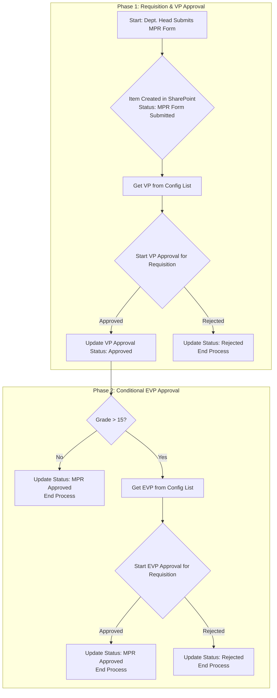
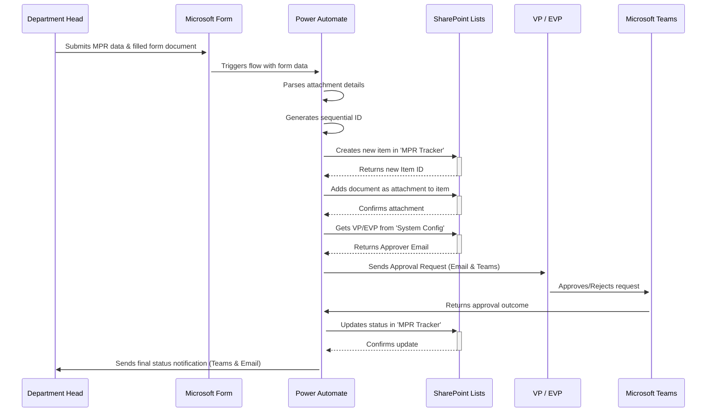

# System Architecture: Phase 1 - Manpower Requisition (MPR)

## 1. Purpose

This document provides a comprehensive overview of the technical architecture for the Manpower Requisition (MPR) automation system. It details the end-to-end business process flow, the interaction between different Microsoft 365 services, the underlying data model, and the security and permissions structure.

---

## 2. Business Process Flow

The system automates the MPR process from initial submission to final approval for the hiring requisition itself. The workflow includes a dynamic, conditional approval step for the EVP based on the grade of the position.

### Process Diagram

### Narrative Workflow

1.  A **Department Head** fills out the **Microsoft Form** with all requisition details and attaches the **internally required, pre-filled MPR form document**.
2.  **Power Automate** triggers, ingesting the form data and the attached document.
3.  A **new item is created** in the `MPR Tracker` SharePoint list. The system generates a unique, sequential **Requisition ID** (e.g., `MPR-EC-024`) and sets the overall `Status` to **`MPR Form Submitted`**.
4.  The flow looks up the responsible **VP** in the `System Configuration` list based on the Business Unit selected.
5.  An approval request is sent to the VP to approve the initial requisition.
6.  **If the VP rejects**, the overall `Status` is updated to "Rejected," notifications are sent, and the process ends.
7.  **If the VP approves**, the flow updates the `VP Approval Status` field to "Approved" and logs the date. It then checks the **Grade** of the position.
8.  **If Grade is 15 or less**, the overall `Status` is updated to **`MPR Approved`**, signifying that HR can begin sourcing. The process for this phase ends.
9.  **If Grade is greater than 15**, the flow looks up the **EVP** and initiates a final approval request for the requisition.
10. If the EVP approves, the `EVP Approval Status` is marked "Approved" and the overall `Status` is set to `MPR Approved`. If rejected, the overall `Status` becomes "Rejected".

**Note:** The overall `Status` column will be used in future phases to track the progress of candidate selection against this approved MPR (e.g., "CV Sourcing", "Candidate VP Approved").

---

## 3. Component & Data Flow Diagram

This diagram illustrates how the different Microsoft 365 services communicate with each other to execute the process.

---

## 4. Data Model

The system relies on two core SharePoint Online lists to store and manage all data.

### `MPR Tracker` List

This list is the central database for every manpower requisition.

| Column Name | Data Type | Purpose & Notes |
| :--- | :--- | :--- |
| **Title** | Single line of text | *Default column.* Populated with the **Job Title**. |
| **Requisition ID** | Single line of text | The unique, user-friendly ID. Format: `MPR-[BU]-[###]`. |
| **Status** | Choice | **The overall progress of the MPR.** Starts with `MPR Form Submitted`, moves to `MPR Approved` or `Rejected`. Will be used for candidate tracking in future phases (e.g., `CV Sourcing`). |
| ... | *(all other fields from the form)* | Captures the core details of the request. |
| **Requester** | Person or Group | The user who submitted the form. Captured automatically. |
| **VP Approval Status** | Choice | `Pending`, `Approved`, `Rejected`. **Tracks the approval decision for the initial requisition request.** |
| **EVP Approval Status** | Choice | `Not Required`, `Pending`, `Approved`, `Rejected`. **Tracks the EVP's decision for the initial requisition.** |
| **VP Approval Date** | Date and Time | Timestamp of the VP's decision. |
| **EVP Approval Date**| Date and Time | Timestamp of the EVP's decision. |
| **Requisition Sequence Number**| Number | An integer used internally by the flow to generate the next sequential ID for a business unit. |
| **Last Update** | Date and Time | Automatically updated by the flow whenever a change is made. |
| **FlowVersion** | Number | A technical field used to prevent infinite loops in the Power Automate flow. |

### `System Configuration` List

This list abstracts logic from the flow, making it easy to maintain without technical intervention.

| Column Name | Data Type | Purpose & Notes |
| :--- | :--- | :--- |
| **Title** | Single line of text | The key for the configuration setting. E.g., `TTE EC VP`, `EVP`. |
| **Approver** | Person or Group | The user account of the person responsible for that role. The flow uses this to find the correct approver. |

---

## 5. Permissions Model

Access to system components is strictly defined by role to ensure data integrity and confidentiality.

| Role | Access Level | Responsibilities & Rationale |
| :--- | :--- | :--- |
| **Department Heads** | **Form Submitter Only** | Can submit new MPRs via the Microsoft Form link. **Rationale:** They have no direct access to the SharePoint list to ensure data privacy between departments. |
| **HR Team** | **Site Owner / Admin** | Can view and edit all data, manage list structures, and administer the Power Automate flow. **Rationale:** Responsible for the end-to-end management and maintenance of the system. |
| **VPs / EVPs** | **Approver & Reader** | Interact with the system via Approval notifications in Teams/Outlook. Granted "Read" access to the `MPR Tracker` list for oversight. **Rationale:** Allows them to monitor the pipeline without being able to edit data directly, ensuring process integrity. |
