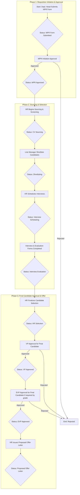

# Manpower Requisition (MPR) & Recruitment Tracking System

## 1. Purpose

This document outlines the structure and workflow for the new end-to-end Manpower Requisition (MPR) and Recruitment Tracking system built in Smartsheet. This system will serve as the single, centralized platform for initiating, approving, and tracking the entire lifecycle of a hiring request—from initial concept to the proposed offer letter.

The primary goals are:
*   To provide VPs and EVPs with a single-sheet view of the real-time status of every active requisition.
*   To standardize the process from requisition initiation to final candidate approval.
*   To create clear accountability and automate status updates at each stage.
*   To establish a foundation for robust, data-driven recruitment analytics.

## 2. End-to-End Recruitment Workflow

The system is designed to manage the entire recruitment pipeline. The `Status` of a requisition will automatically update as it progresses through the following key milestones.

## 3. Data Structure: Sheet Columns

The Manpower Requisition sheet is structured to capture all necessary information for the entire process.

### A. Initial Request Details (Filled by Requester via Form)
| Column Name | Description |
| :--- | :--- |
| **Business Unit** | The business unit for the request (`TTE EC`, `TTE FM`, `TTE PS`). |
| **Job Title** | The official title for the position. |
| **Hiring Type** | The nature of the hire: `Project/Site-Based` or `Operational`. |
| **Project/ Site** | *Conditional:* The specific project name, shown only if 'Project/Site-Based'. |
| **Grade** | The proposed grade for the role (`10` - `19`). |
| **Number of Positions**| The total number of people to be hired for this role. |
| **Proposed Date of Joining**| The target start date for the new hire(s). |
| **Justification for Request**| The reason for the hire: `New Project`, `Resignation`, `Increased Workload`. |
| **Employee Resigned ID/Name**| *Conditional:* Details of the employee being replaced, shown only if 'Resignation'. |
| **Required Qualifications**| Key educational and professional qualifications. |
| **Required Skills** | Essential technical or soft skills for the role. |

### B. Automated Tracking & Live Status
| Column Name | Description |
| :--- | :--- |
| **Requisition ID** | A unique ID automatically generated for each request. |
| **Created (Date)** | The date the request form was submitted, captured automatically. |
| **Created By** | The user who submitted the form, captured automatically. |
| **Status** | The overall live status of the requisition, which updates automatically as the request moves through the workflow shown above. |

### C. Approval Workflow Fields
| Column Name | Description |
| :--- | :--- |
| **MPR Initiation Approval Status** | Approval to begin recruitment: `Submitted`, `Approved`, `Rejected`. |
| **MPR Initiation Approval Date** | The date the initiation approval was given, captured automatically. |
| **VP Approval Status** | Final candidate approval from the VP: `Submitted`, `Approved`, `Rejected`.|
| **VP Approval Date** | The date the VP provided their decision, captured automatically. |
| **EVP Approval Status** | Final candidate approval from the EVP: `Submitted`, `Approved`, `Rejected`.|
| **EVP Approval Date** | The date the EVP provided their decision, captured automatically. |

## 4. User Access & Permissions

To ensure data integrity and proper governance, user access to the sheet will be strictly defined by role.

| Role | Access Level | Permissions & Responsibilities |
| :--- | :--- | :--- |
| **HR Team** | **Admin** | - Can view and edit all fields.  - Manages workflows and automation.  - Updates candidate-related stages (`CV Sourcing`, `Interview`, etc.).  - Initiates all approval requests. |
| **EVP / VPs** | **Editor (Approver)** | - Can view the entire sheet to monitor all requisitions.  - Cannot edit fields directly.  - Can **only** interact via Approval Requests sent to them. |
| **Dept. Heads / Managers** | **Viewer (via Report)** | - **Do not** get direct access to the master sheet.  - Will receive a filtered **Report** showing only the requisitions for their specific Business Unit.  - Can submit new MPRs via the Smartsheet Form. |

## 5. Future Enhancements

This system represents Phase 1 of our recruitment process digitization. In future phases, the tracking capabilities will be extended to include post-acceptance stages, such as:
*   Final Offer Letter issuance and tracking.
*   Visa and onboarding process management.
*   Confirmation of the employee's final Date of Joining.

This phased approach ensures a smooth rollout while building towards a fully comprehensive HR management tool.
