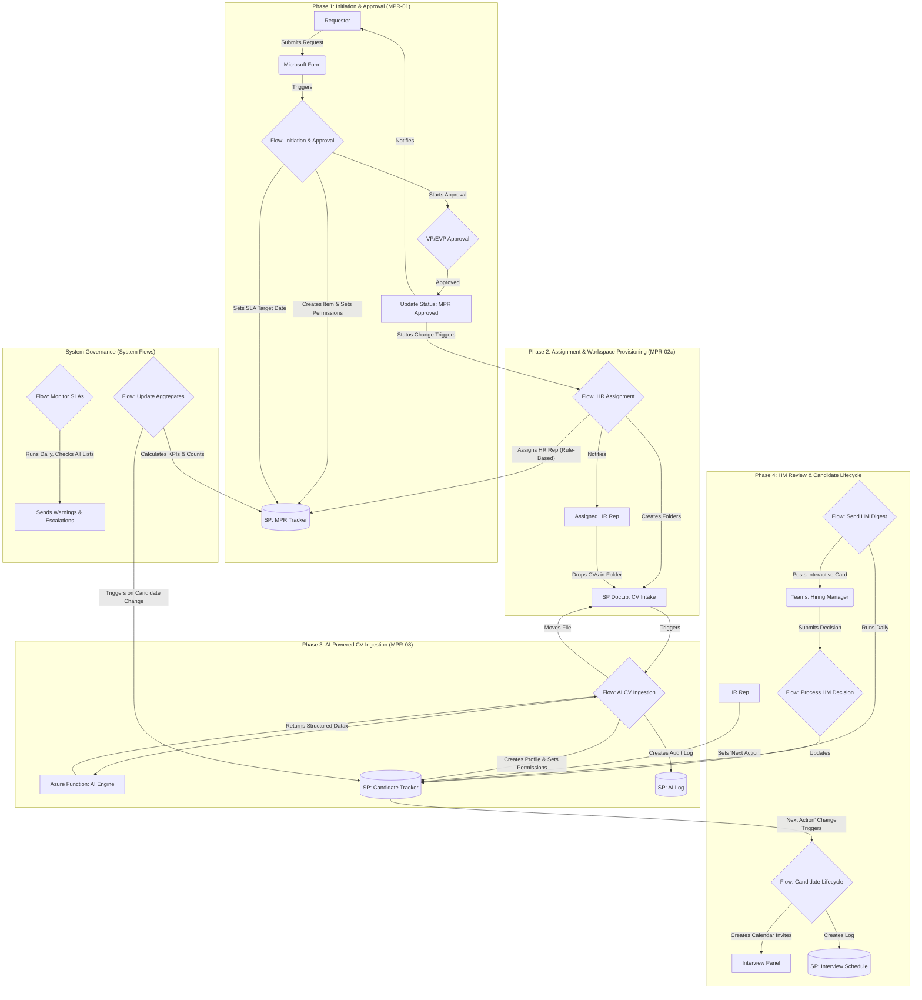

# Manpower Requisition (MPR) Automation Suite & Talent Intelligence Engine


[](./docs/01-Business-Process-Overview.md)

This repository contains the full automation solution and documentation for the TTE Integrated HR Recruitment Tracker. The suite leverages the Microsoft Power Platform and Azure AI to create a comprehensive, enterprise-grade system that manages the entire recruitment lifecycle—from initial request and multi-level approvals to AI-powered CV processing, candidate management, and proactive SLA monitoring.

## Business Value Proposition

This solution delivers strategic value to the organization by:

-   **AI-Powered Efficiency:** Drastically reduces manual data entry by using an AI engine to parse CVs, extract key information, and create standardized candidate profiles automatically.
-   **Enforcing Governance & Security:** Implements a rule-based approval workflow, conditional logic for EVP approvals based on grade, and a robust **item-level permissions model** to ensure strict data confidentiality.
-   **Providing Full Transparency & Insights:** Creates a centralized, real-time view of every requisition and candidate. A powerful KPI aggregation engine calculates key metrics like Time-to-Fill, providing actionable data for process improvement.
-   **Accelerating Time-to-Hire:** By automating bottlenecks like approvals, CV screening, and interview scheduling, and by proactively monitoring SLAs with a "guardian" flow, the solution minimizes delays at every stage.
-   **Improving User Experience:** Provides a best-in-class, interactive experience for Hiring Managers to review and shortlist candidates directly within Microsoft Teams.

## High-Level Process Flow

The diagram below illustrates the end-to-end journey of a requisition and its candidates as they move through the automated system.



## Technology Stack

This solution uses a hybrid architecture, combining the strengths of the Power Platform for orchestration and Azure for specialized, high-performance processing.

-   **Orchestration Engine:** Power Automate
-   **Data Backend:** SharePoint Online Lists
-   **Intelligent Processing Engine:** **Azure Functions (Python)**
-   **Artificial Intelligence:** **Azure OpenAI Service (GPT-4)**
-   **User Input & Interaction:** Microsoft Forms, Microsoft Teams (Adaptive Cards), Outlook

## Repository Structure

The project is organized to separate the low-code Power Platform solution from the pro-code Azure Function, promoting a "Documentation as Code" methodology.

```bash
/integrated-hr-recruitment-tracker/
├── README.md                 # You are here
├── CHANGELOG.md              # Log of all changes and versions
│
├── flows/                    # Exported JSON definitions of each Power Automate flow
│   ├── MPR-01-InitiationandApproval.json
│   ├── MPR-02a-HRAssignment.json
│   └── ... (and so on for all flows)
│
├── docs/                     # Detailed documentation for the Power Platform solution
│   ├── 01-Business-Process-Overview.md
│   ├── 02-Solution-Architecture.md
│   ├── 03-Technical-Flow-Breakdown.md
    ├── 04-User-Guides.md
    └── 05-Deployment-and-Maintenance.md
│
└── ai-processing-azure-functions/  # Self-contained project for the Azure Function
    ├── function_app.py
    ├── shared_code/
    │   ├── document_processor.py
    │   └── openai_service.py
    ├── tests/
    └── README.md             # Dedicated README for the Azure Function
```

## Documentation Portal

This README provides a high-level overview. For detailed information, please refer to the specific documents in the `/docs` folder. The Azure Function project contains its own separate, developer-focused documentation.

| Document                                          | Target Audience                      | Description                                                              |
| :------------------------------------------------ | :----------------------------------- | :----------------------------------------------------------------------- |
| **[Business Process Overview](./docs/01-Business-Process-Overview.md)** | **Business Stakeholders, Management**| Explains the end-to-end recruitment process, business rules, and roles. |
| **[Solution Architecture](./docs/02-Solution-Architecture.md)** | **Technical Leads, Architects**        | Details the technology, SharePoint data model, and component interactions. |
| **[Technical Flow Breakdown](./docs/03-Technical-Flow-Breakdown.md)** | **Developers, Technical Support**      | A deep dive into each Power Automate flow, explaining its logic and key actions.|
| **[User Guides](./docs/04-User-Guides.md)**             | **End-Users (HR, Hiring Managers)**    | Step-by-step instructions with screenshots on how to use the system.       |
| **[Deployment & Maintenance](./docs/05-Deployment-and-Maintenance.md)** | **IT Admins, Future Developers**       | Covers deployment, configuration, and maintenance protocols.              |

## Key Contacts

-   **Business Process Owner:** Richard Bashyam
-   **Technical Lead & Developer:** Abu Huraira

## How to Contribute

This project adheres to a "Documentation as Code" philosophy. All changes, whether to the flows or the documentation, must be managed through a GitHub Pull Request. For detailed instructions, please see our **[Contribution Guidelines](./CONTRIBUTING.md)**.

---
_This documentation is actively maintained. For the history of changes, please see the [CHANGELOG.md](./CHANGELOG.md)._