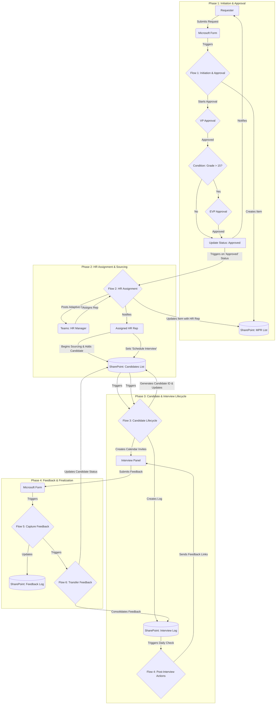

# Manpower Requisition (MPR) Automation Suite


[](./docs/01-Business-Process-Overview.md)

This repository contains the full automation solution and documentation for the Al Gurg Integrated HR Recruitment Tracker. The suite leverages the Microsoft Power Platform to streamline and automate the end-to-end Manpower Requisition (MPR) process, from initial request and multi-level approvals to candidate lifecycle management and interview feedback consolidation.

## Business Value Proposition

This solution was designed not just to automate tasks, but to deliver strategic value to the organization by:

-   **Enhancing Efficiency:** Drastically reduces manual data entry, email follow-ups, and administrative overhead for the HR team and hiring managers.
-   **Providing Full Transparency:** Creates a centralized, real-time view of every requisition's status, eliminating information silos and providing clarity to all stakeholders.
-   **Enforcing Governance & Compliance:** Standardizes the approval process, ensuring that the correct hierarchical approvals (VP, EVP) are obtained based on predefined business rules (e.g., position grade).
-   **Improving Data Integrity:** Establishes a single source of truth in SharePoint, reducing errors that arise from managing processes across multiple spreadsheets and email chains.
-   **Accelerating Time-to-Hire:** By automating bottlenecks like approvals and feedback requests, the solution helps reduce the overall time it takes to fill a position.

## High-Level Process Flow

The diagram below illustrates the end-to-end journey of a manpower requisition as it moves through the automated system.



## Technology Stack

This solution is built entirely on the Microsoft Power Platform, ensuring seamless integration and security within our existing O365 environment.

-   **Automation Engine:** Power Automate
-   **Data Backend:** SharePoint Online Lists
-   **User Interface (Input):** Microsoft Forms
-   **User Interface (Interaction):** Microsoft Teams (Adaptive Cards), Outlook (Approvals & Notifications)
-   **File Storage:** OneDrive for Business (for form attachments)

## Repository Structure

The project is organized to separate the flow definitions from the documentation, promoting a "Documentation as Code" methodology.

```bash
/mpr-automation-suite/
├── .gitignore
├── README.md                 # You are here
├── CHANGELOG.md              # Log of all changes and versions
│
├── flows/                    # Exported JSON definitions of each Power Automate flow
│   ├── MPR-01-InitiationandApproval.json
│   ├── MPR-02-HRAssignment.json
│   └── ... (and so on for all 6 flows)
│
└── docs/                     # Detailed documentation for all audiences
    ├── 01-Business-Process-Overview.md
    ├── 02-Solution-Architecture.md
    ├── 03-Technical-Flow-Breakdown.md
    ├── 04-User-Guides.md
    └── 05-Deployment-and-Maintenance.md
```

## Documentation Portal

This README provides a high-level overview. For detailed information, please refer to the specific documents below.

| Document                                          | Target Audience                      | Description                                                                                             |
| :------------------------------------------------ | :----------------------------------- | :------------------------------------------------------------------------------------------------------ |
| **[Business Process Overview](./docs/01-Business-Process-Overview.md)** | **Business Stakeholders, Management** | Explains the end-to-end recruitment process in plain language, outlining the stages, business rules, and roles. |
| **[Solution Architecture](./docs/02-Solution-Architecture.md)** | **Technical Leads, Architects**        | Details the technology stack, the SharePoint data model, and how the different system components interact. |
| **[Technical Flow Breakdown](./docs/03-Technical-Flow-Breakdown.md)** | **Developers, Technical Support**      | Provides a deep dive into each Power Automate flow, explaining its trigger, logic, and key actions.        |
| **[User Guides](./docs/04-User-Guides.md)**             | **End-Users (HR, Hiring Managers)**    | Step-by-step instructions with screenshots on how to use the system (e.g., submit a request, assign a rep). |
| **[Deployment & Maintenance](./docs/05-Deployment-and-Maintenance.md)** | **IT Admins, Future Developers**       | Covers instructions for deploying the solution, configuring it, and performing routine maintenance tasks.     |

## Key Contacts

-   **Business Process Owner:** Richard Bashyam
-   **Technical Lead & Developer:** Abu Huraira

## How to Contribute

This project adheres to a "Documentation as Code" philosophy, and we welcome contributions that improve the solution. All changes, whether to the flows or the documentation, must be managed through a GitHub Pull Request to ensure quality and consistency.

For detailed instructions on the development workflow, branching strategy, and the mandatory documentation checklist, please see our **[Contribution Guidelines](./CONTRIBUTING.md)**.

---
_This documentation is actively maintained. For the history of changes, please see the [CHANGELOG.md](./CHANGELOG.md)._
